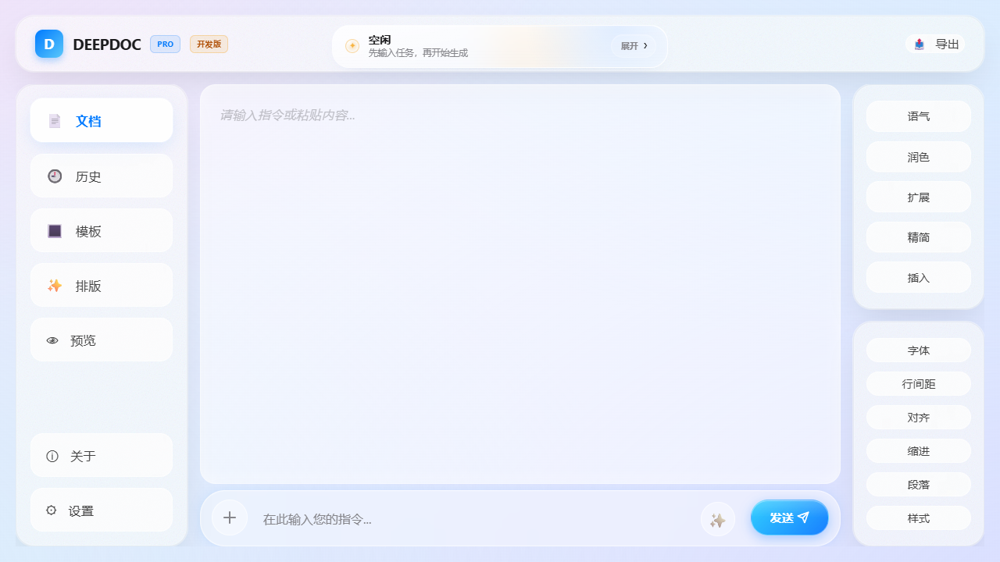
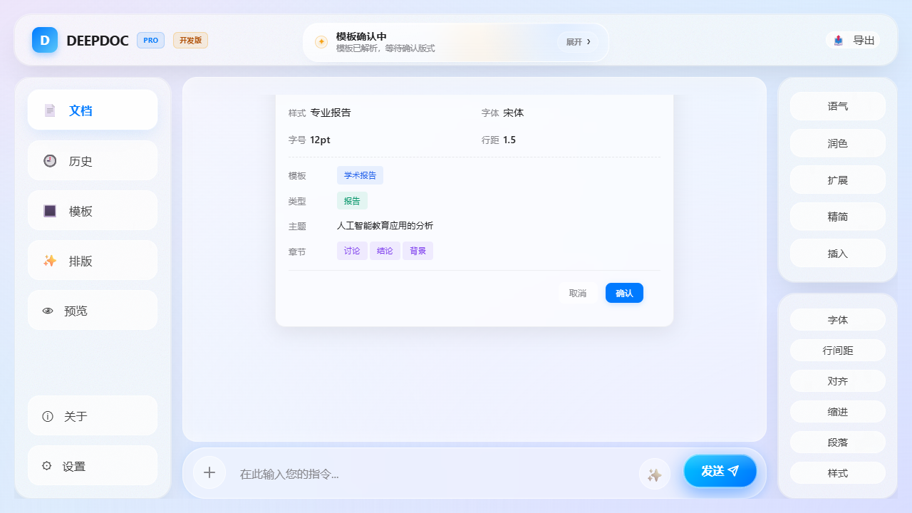
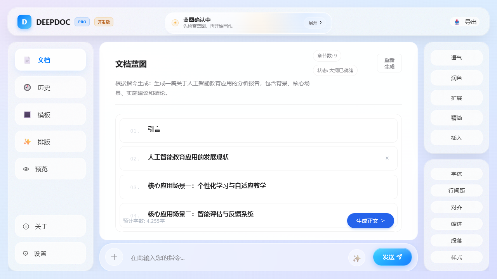
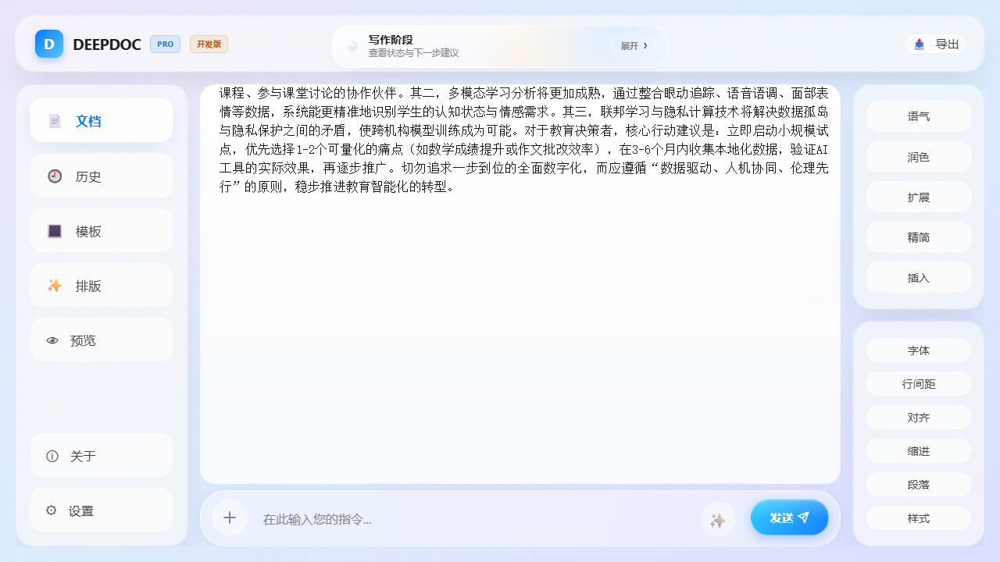
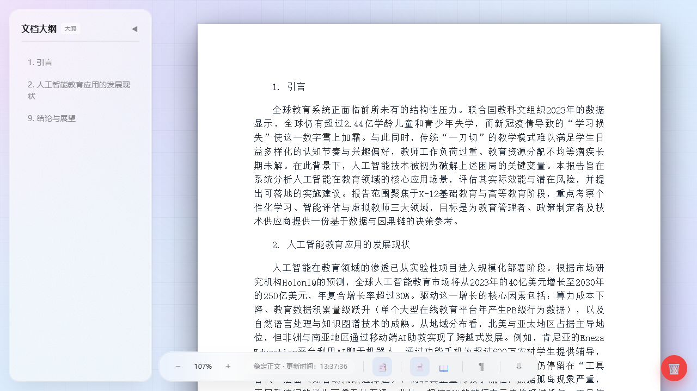

# DeepDcc

> 面向正式文档生产的 AI 工作台，而不是只会“生成一段文字”的聊天写作器。

DeepDcc 的目标，是把资料理解、蓝图规划、正文生成、公式入稿、预览核对和正式导出收敛成一条可控闭环。它更关心“最终能不能交稿”，而不只关心“回答看起来像不像”。

## 当前状态

- 当前官网：<https://deepdcc-pro.cn>
- 当前公开通道：`testing`
- 当前测试策略：首次激活后滚动 `30` 天
- 当前平台：Windows x64
- 当前目标：测试版真实验证与反馈回收

## 快速入口

- 官网主页：<https://deepdcc-pro.cn>
- 下载最新测试版：<https://deepdcc-pro.cn/downloads/DeepDcc-Test-Setup.exe>
- 更新日志：<https://deepdcc-pro.cn/changelog.html>
- 常见问题：<https://deepdcc-pro.cn/faq.html>
- 问题反馈：<https://deepdcc-pro.cn/feedback.html>
- 公开讨论：<https://github.com/JaylanJerry/DeepDcc/discussions>

## 它解决什么问题

普通 AI 写作工具的问题，不是能不能生成，而是正式交付前仍然隔着一大段返工链：

- 资料读了很多，但正文和论据脱节
- 结构能生成，但蓝图不可控、章节难干预
- 预览看着还行，导出后版式和结构散架
- 公式只是截图或源码，交稿前还要在 Word 里重做
- 文件解析失败后，系统却继续假装成功

DeepDcc 的设计目标，就是减少“生成结果”和“正式交付”之间的断裂。

## 它和常见 AI 写作器的区别

| 维度 | 常见聊天式写作器 | DeepDcc |
| --- | --- | --- |
| 输出重点 | 先给出一段答案 | 先收口成一份可交付文档 |
| 长文控制 | 通常直接释放正文 | 先蓝图确认，再开始写作 |
| 公式处理 | 常停留在源码或截图 | 尽量进入正式文档链 |
| 预览关系 | 预览常是附属功能 | 预览是交付前核对环节 |
| 导出目标 | 复制粘贴为主 | 面向 Word 等正式交付 |
| 失败处理 | 经常继续假装成功 | 更强调失败可见与中止 |

## 核心特点

- 蓝图先行：正文释放前先确认结构，长文档更可控
- 正文、预览、导出尽量围绕同一份稳定内容源，降低所见非所得
- 公式直接进入文档链，不把正式公式流程留给交稿前手工补救
- 面向 Word 正式交付链路，强调结构、排版和可继续编辑性
- 本地优先处理资料和部分运行链路，更适合高敏感场景
- 失败优先中止并提示，而不是伪造“已经成功读取/生成”

详细说明见：[功能详解](docs/features.md)

## 一条完整工作流

1. 输入任务并挂载资料
2. 系统先做智能解析与蓝图规划
3. 用户确认或调整蓝图
4. 生成正文，完成质量审核与公式入稿
5. 打开预览核对结构、分页与导出结果
6. 导出正式文档并继续交付

详细流程见：[工作流程](docs/workflow.md)

## 适合谁

- 需要正式报告而不只是聊天回答的用户
- 需要先确认结构，再释放正文的用户
- 需要公式、预览和正式导出链路一致的用户
- 需要 Word 继续编辑交付稿的用户
- 对资料敏感、本地优先、失败可见更在意的用户

## 不太适合谁

- 只想快速得到一小段灵感回答的用户
- 只看聊天窗口，不关心正式导出链路的用户
- 当前就需要跨平台公开客户端的用户

## 产品画面

### 1. 工作台首页

### 2. 智能解析确认

### 3. 蓝图确认与章节干预

### 4. 正文生成与预览核对

## 示例与场景

当前公开示例是脱敏后的产品演示素材，重点展示工作流，而不是暴露内部样本或实现细节。

- [示例总览](docs/examples.md)
- [教育分析报告示例](assets/examples/education-report.md)
- [公式型主题示例](assets/examples/schrodinger-overview.md)

## 测试版说明

当前对外只公开 `testing` 通道。

- 下载的是 Windows x64 测试版
- 首次激活后开始计算 30 天试用期
- About 模块可直接检查更新
- 正式版与收费链尚未公开上线

如果你在体验中遇到问题，优先通过官网反馈页或本仓库 Discussions 留言。

## 文档导航

- [功能详解](docs/features.md)
- [工作流程](docs/workflow.md)
- [示例与适用场景](docs/examples.md)
- [常见问题](docs/faq.md)
- [更新日志与版本入口](docs/changelog-links.md)

## 讨论与反馈

本仓库用于产品介绍、公开资料与测试版引导，不作为主开发源码仓库开放协作。

- 功能建议、使用体验、工作流问题：优先使用 Discussions
- 安装、激活、导出、更新问题：优先使用官网反馈页
- 不适合公开描述的问题：请通过官网或联系邮箱私下反馈

## 版权与使用边界

本仓库不代表 DeepDcc 的主开发源码公开仓库。

除非你获得维护者的明确授权，否则本仓库中的截图、文案、示例资料和下载入口，不代表你获得对产品源码、安装包或官方分发渠道的再发布权利。

详细说明见 [NOTICE.md](NOTICE.md)。
