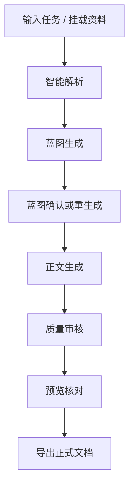

# 工作流程

## 总览

## 1. 输入任务

用户输入写作目标，也可以在后续阶段挂载 PDF、Word、Excel 等资料，让资料参与后续生成与引用链路。

**这一阶段的产物**：
- 原始需求
- 可挂载资料
- 初始写作方向

## 2. 智能解析

系统先尝试识别任务类型、文体、结构倾向和可能的模板/样式要求，而不是直接释放正文。

**这一阶段的产物**：
- 结构化理解结果
- 文体与样式初判
- 后续蓝图生成输入

## 3. 蓝图确认

系统生成章节蓝图，用户可以：

- 直接确认
- 修改章节标题
- 重新生成大纲

这一阶段的目标是把“后面要写什么”先收口，再开始长文生成。

**这一阶段的产物**：
- 可确认的章节结构
- 明确的正文展开边界

## 4. 正文生成

正文按蓝图展开。对于结构化文档，系统会尽量维持章节顺序、上下文一致性和面向正式交付的段落结构。

**这一阶段的产物**：
- 初版正文
- 面向交付的章节化内容

## 5. 质量审核

正文完成后进入质量审核，用于检查结构完整性、连贯性和必要修复，而不是简单把“流结束”当成真正完成。

**这一阶段的产物**：
- 审核结果
- 必要修复后的稳定正文

## 6. 预览核对

预览阶段用于确认分页、层次、段落和公式表现。目标是让预览更接近导出结果，而不是再生成一份完全独立的文档。

**这一阶段的产物**：
- 更接近交付结果的可视化核对视图

## 7. 正式导出

在确认正文与预览一致后，再进入导出链路，面向正式交付文档继续处理。

**这一阶段的产物**：
- 正式导出文档
- 可继续交付或二次编辑的结果
